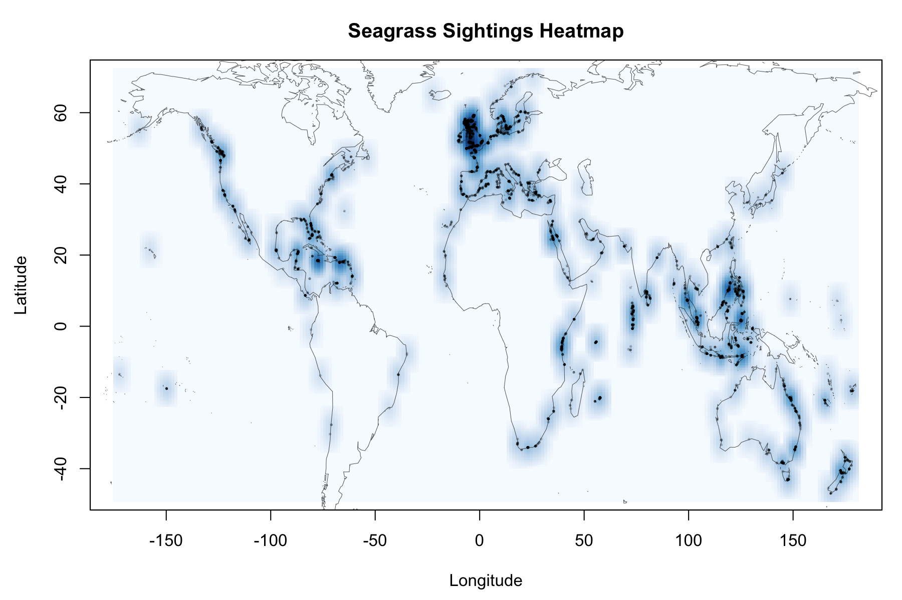

# Seagrass Spotter Heatmap

This project creates a heatmap showing the global distribution of seagrass sightings submitted to the [SeagrassSpotter](https://seagrassspotter.org) platform.



---

## Installation

This project requires the `maps` package:

```r
install.packages("maps")
```


> [!CAUTION]
> Going forward, a better solution for package management is recommended such as `docker` or `renv`.


To run the analysis, drop the CSV file into the data folder (as `data/sightings.csv`) and run `r/analysis/heatmap.R`. The script will output the heatmap as a PNG into the `output` folder.


